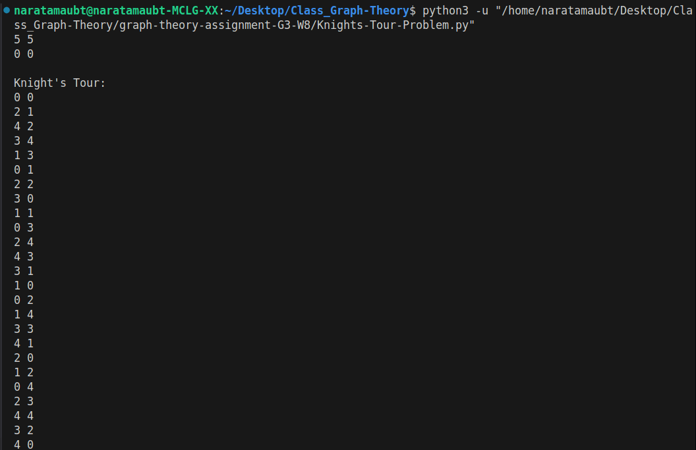
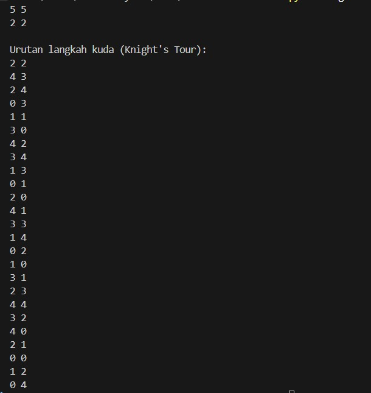
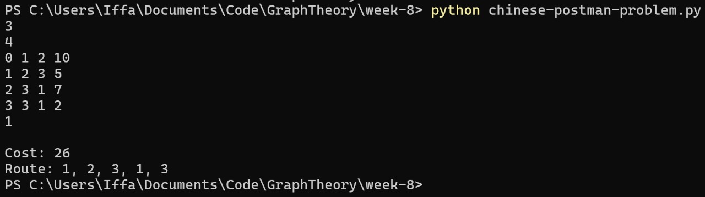
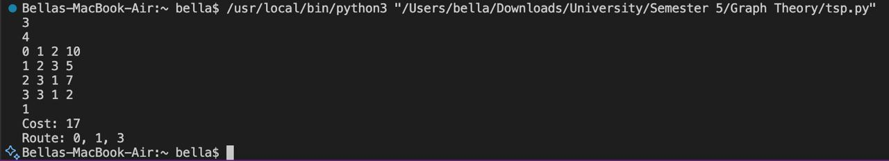

    <h1>Graph Theory - EF234304 (2025)</h1>

  <b>Institut Teknologi Sepuluh Nopember</b> 
  Sepuluh Nopember Institute of Technology

  

  

Source code to <a href="https://www.its.ac.id/informatika/wp-content/uploads/sites/44/2023/11/Module-Handbook-Bachelor-of-Informatics-Program-ITS.pdf">Graph Theory (EF234304)</a>'s group assignment. All solutions were created by <a href="https://github.com/aleahfaa">Iffa Amalia Sabrina</a>, <a href="https://github.com/bellaacp">Bella Angeline Chong Puteri</a>, <a href="https://github.com/zan4yov">Razan Widya Reswara</a>, and <a href="https://github.com/DocHudson45">Muhammad Dzaky Radithya Ryrdi</a>.

  <table>
    <thead>
      <tr>
        <th align="center">NRP</th>
        <th align="center">Name</th>
      </tr>
    </thead>
    <tbody>
      <tr>
        <td align="justify">5025221077</td>
        <td align="justify">Iffa Amalia Sabrina</td>
      </tr>
      <tr>
        <td align="justify">5025231073</td>
        <td align="justify">Bella Angeline Chong Puteri</td>
      </tr>
      <tr>
        <td align="justify">5025241004</td>
        <td align="justify">Razan Widya Reswara</td>
      </tr>
      <tr>
        <td align="justify">5025241010</td>
        <td align="justify">Muhammad Dzaky Radithya Ryrdi</td>
      </tr>
    </tbody>
  </table>

On behalf of:

<b>Ilham Gurat Adillion, S.Kom., M.Kom.</b>

# Knight's Tour Problem

The **Knight's Tour** is a classic problem where a knight must visit every square on a chessboard **exactly once**. This is an instance of the more general **Hamiltonian Path** problem.

Our solution uses a **standard backtracking algorithm**. This is a brute-force approach that recursively explores every possible sequence of moves until a valid tour is found.

## How Our Code Works

**Input:**
- The dimensions of the chessboard (e.g., 8 for an 8x8 board).
- The starting coordinates for the knight (e.g., 0 0).

**Process:**
1.  **Initialization:** An empty board is created where each square is marked as unvisited (`-1`).
2.  **Recursive Search:** A recursive function (`backtrack`) attempts to build the tour step-by-step.
3.  **Exploration:** From the knight's current square, the function tries each of the 8 possible moves.
4.  **Backtracking:** If a move leads to a dead end (a position from which the tour cannot be completed), the function "backtracks" by undoing the move (resetting the square to `-1`) and trying the next alternative.
5.  **Completion:** This process continues until a path is found that visits all `n*n` squares.

**Output:**
- If a solution is found, the program prints the coordinates of the path in the correct order.
- If no solution can be found from the starting point, it reports that a solution does not exist.

## Example Run
Here is an example of a successful Knight's Tour on an 8x8 board:

# Chinese Postman Problem (CPP)

The **Chinese Postman Problem (CPP)** aims to find the shortest possible route that a postman must take to traverse every street (edge) at least once before returning to the start.

The solution involves making the graph **Eulerian** (ensuring every vertex has an even degree) by duplicating the cheapest paths between vertices of odd degree.

## How Our Code Works

Our code implements the full, exact algorithm for solving the CPP.

**Input:**
- A weighted, undirected graph represented by nodes and a list of edges with their costs.

**Process:**
1.  **Identify Odd Vertices:** The code first finds all vertices with an odd degree.
2.  **Calculate Shortest Paths:** It uses **Floyd-Warshall algorithm** to compute the shortest path between every pair of these odd-degree vertices.
3.  **Find Minimum Weight Matching:** It generates all possible pairings of the odd vertices and calculates the total cost for each set of pairs. It then selects the pairing with the absolute minimum total cost. These are the paths that need to be traversed twice.
4.  **Find Eulerian Tour:** After conceptually adding these new paths to the graph, all vertices now have an even degree. The code then uses a **stack-based algorithm (Hierholzer's)** to find the final Eulerian tour.
5.  **Calculate Total Cost:** The final cost is the sum of all original edge weights plus the cost of the minimum weight matching.

**Output:**
- The program outputs the **minimum total cost** for the postman's route and the **sequence of edge IDs** in that route.

## Example Run
Here is an example run where the code calculates the minimum cost for a given graph:

# Traveling Salesperson Problem (TSP)

The **Traveling Salesperson Problem (TSP)** seeks the shortest possible route that visits **each city exactly once** and returns to the origin. This is a minimum-weight **Hamiltonian Cycle** problem.

Our program solves this using a **brute-force (exact) algorithm**. It systematically checks every possible route to guarantee it finds the absolute best one.

## How Our Code Works

**Input:**
- A list of cities (nodes) and the distances (weights) between them.

**Process:**
1.  **Generate All Permutations:** The algorithm generates a list of every single possible ordering (permutation) of the cities to visit.
2.  **Calculate Cost for Each Tour:** For each unique permutation, it constructs a complete tour starting and ending at the designated start city. It then calculates the total cost of that tour by summing the weights of its edges.
3.  **Find the Optimal Tour:** The code keeps track of the minimum cost found so far. After checking all possible tours, the one with the lowest total cost is the optimal solution.

**Output:**
- The program prints the **minimum cost** and the **sequence of edges** that form the optimal route.

**Note:** Because this method checks every possibility, it is only feasible for a small number of cities (typically N < 11) due to its factorial ($O(N!)$) time complexity.

## Example Run
Here is an example run showing the optimal path and total cost found by the brute-force algorithm:

